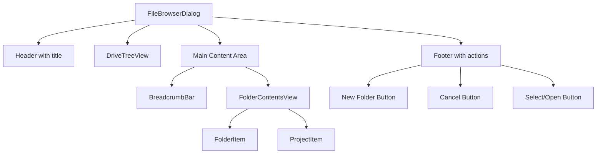
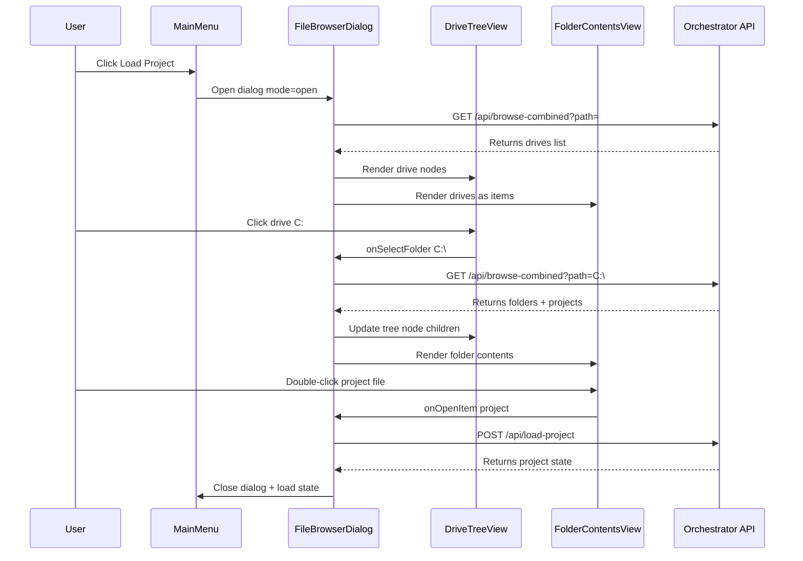
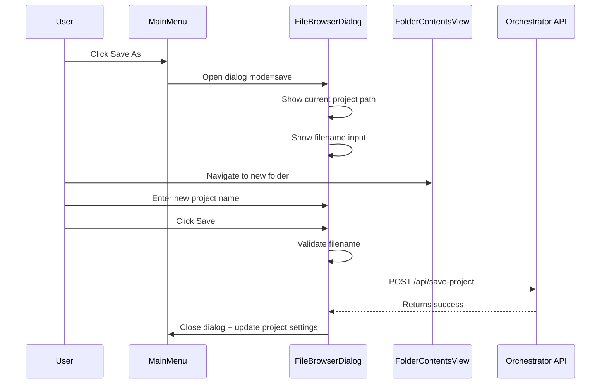
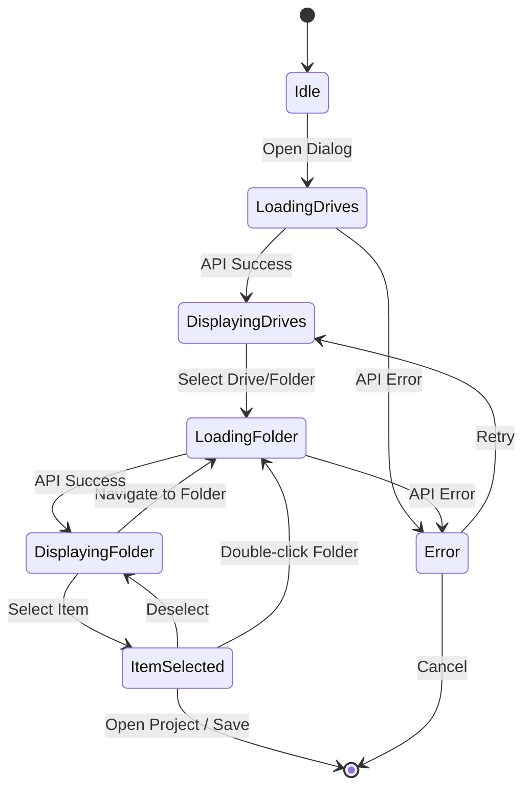

# Improved Load/Save Project Dialog Design Document

**Date:** 2026-02-01  
**Author:** AI Architect  
**Status:** Design Phase  
**Target:** React Web UI (CinemaPromptEngineering/frontend/)

---

## Executive Summary

This document outlines the design for improved Load Project and Save As dialogs in the Director's Console React Web UI. The new design addresses user feedback about navigation difficulties, off-screen positioning, and missing "Save As" functionality by implementing a Windows Explorer-like dual-pane layout.

---

## Table of Contents

1. [Current Implementation Analysis](#1-current-implementation-analysis)
2. [User Problems Identified](#2-user-problems-identified)
3. [Proposed Solution Architecture](#3-proposed-solution-architecture)
4. [Component Design](#4-component-design)
5. [API Requirements](#5-api-requirements)
6. [State Management](#6-state-management)
7. [Implementation Plan](#7-implementation-plan)
8. [Mermaid Diagrams](#8-mermaid-diagrams)

---

## 1. Current Implementation Analysis

### 1.1 Existing Files and Their Roles

| File | Purpose | Location |
|------|---------|----------|
| [`FolderBrowserModal.tsx`](../CinemaPromptEngineering/frontend/src/storyboard/components/FolderBrowserModal.tsx) | Generic folder browser modal | `storyboard/components/` |
| [`FolderBrowserModal.css`](../CinemaPromptEngineering/frontend/src/storyboard/components/FolderBrowserModal.css) | Styling for folder browser | `storyboard/components/` |
| [`MainMenu.tsx`](../CinemaPromptEngineering/frontend/src/storyboard/components/MainMenu.tsx) | Top-left dropdown menu with Save/Load actions | `storyboard/components/` |
| [`ProjectSettingsModal.tsx`](../CinemaPromptEngineering/frontend/src/storyboard/components/ProjectSettingsModal.tsx) | Project configuration dialog | `storyboard/components/` |
| [`project-manager.ts`](../CinemaPromptEngineering/frontend/src/storyboard/services/project-manager.ts) | Project state management service | `storyboard/services/` |
| [`StoryboardUI.tsx`](../CinemaPromptEngineering/frontend/src/storyboard/StoryboardUI.tsx) | Main UI component integrating all pieces | `storyboard/` |

### 1.2 Current FolderBrowserModal Architecture

```typescript
interface FolderBrowserModalProps {
  isOpen: boolean;
  onClose: () => void;
  onSelect: (path: string) => void;
  orchestratorUrl: string;
  initialPath?: string;
  title?: string;
}
```

**Current Features:**
- Single-pane folder list view
- Path input field with manual navigation
- Back button (to parent directory)
- Refresh button
- New Folder creation
- Drive/folder icon differentiation

**Current Limitations:**
- No persistent tree view on the left
- Cannot navigate to drive roots easily once deep in a folder structure
- No breadcrumb navigation
- Project files not displayed in folder view
- No preview of project contents

### 1.3 Backend API Endpoints (Orchestrator)

| Endpoint | Method | Purpose |
|----------|--------|---------|
| `/api/browse-folders` | GET | List folders and drives |
| `/api/list-projects` | GET | List project files in a folder |
| `/api/save-project` | POST | Save project state to filesystem |
| `/api/load-project` | POST | Load project state from filesystem |

### 1.4 Current Load Project Flow

1. User clicks "Load Project" in MainMenu
2. `FolderBrowserModal` opens with folder selection
3. User navigates to folder containing project
4. After folder selection, `listProjects()` is called
5. If projects found, a secondary list appears
6. User selects project file to load

**Problem:** This two-step process is confusing. Users cannot see project files while browsing folders.

---

## 2. User Problems Identified

### 2.1 Window Appears Off-Screen
- **Cause:** Modal positioning is relative to viewport but may be affected by nested context
- **Solution:** Use fixed positioning with centered layout, ensure z-index is high enough

### 2.2 No Way to Navigate Back to Root
- **Cause:** Parent path becomes `null` at drive root, but no way to go back to drive list
- **Solution:** Add persistent drive/tree panel on the left that is always accessible

### 2.3 Requires Scrolling to See Projects
- **Cause:** Projects are listed after folder selection, in a separate area
- **Solution:** Show project files inline with folders in the right panel, with visual distinction

### 2.4 Missing Save As Functionality
- **Cause:** Only `onSaveProject` exists, which saves to current project path
- **Solution:** Add `onSaveProjectAs` that opens a dialog for selecting new location and name

---

## 3. Proposed Solution Architecture

### 3.1 Design Philosophy

Implement a **Windows Explorer-like dual-pane layout**:
- **Left Pane (Tree View):** Hierarchical navigation with drives and expandable folders
- **Right Pane (Contents View):** Shows contents of selected folder including project files

### 3.2 New Component Structure

```
FileBrowserDialog/
├── FileBrowserDialog.tsx          # Main modal container
├── FileBrowserDialog.css          # Styling
├── components/
│   ├── DriveTreeView.tsx          # Left pane - tree navigation
│   ├── FolderContentsView.tsx     # Right pane - folder contents
│   ├── BreadcrumbBar.tsx          # Path breadcrumb navigation
│   ├── ProjectPreviewCard.tsx     # Project file preview
│   └── NewFolderDialog.tsx        # New folder creation dialog
└── hooks/
    └── useFileBrowser.ts          # State management hook
```

### 3.3 Component Responsibilities

| Component | Responsibility |
|-----------|---------------|
| `FileBrowserDialog` | Modal wrapper, layout, action buttons |
| `DriveTreeView` | Displays drives and expandable folder tree |
| `FolderContentsView` | Lists items in current folder with selection |
| `BreadcrumbBar` | Clickable path segments for quick navigation |
| `ProjectPreviewCard` | Shows project metadata when hovering/selecting |
| `NewFolderDialog` | Creates new folders with validation |
| `useFileBrowser` | Manages folder state, navigation, and caching |

---

## 4. Component Design

### 4.1 FileBrowserDialog Props

```typescript
interface FileBrowserDialogProps {
  isOpen: boolean;
  onClose: () => void;
  mode: 'open' | 'save';
  orchestratorUrl: string;
  initialPath?: string;
  projectName?: string; // For save mode - default filename
  onOpenProject: (projectPath: string) => void;
  onSaveProject?: (folderPath: string, projectName: string) => void;
}
```

### 4.2 DriveTreeView Component

```typescript
interface TreeNode {
  id: string;
  name: string;
  path: string;
  type: 'drive' | 'folder';
  children?: TreeNode[];
  isLoading?: boolean;
  isExpanded?: boolean;
}

interface DriveTreeViewProps {
  nodes: TreeNode[];
  selectedPath: string;
  onSelectFolder: (path: string) => void;
  onExpandFolder: (path: string) => void;
}
```

**Features:**
- Lazy loading: Children fetched on expand
- Visual indicators for loading state
- Drive icons differentiated from folder icons
- Selected item highlighted
- Keyboard navigation support

### 4.3 FolderContentsView Component

```typescript
interface FolderItem {
  name: string;
  path: string;
  type: 'drive' | 'folder' | 'project';
  metadata?: ProjectMetadata; // For project files
}

interface ProjectMetadata {
  name: string;
  savedAt: string;
  panelCount: number;
}

interface FolderContentsViewProps {
  items: FolderItem[];
  selectedItem: string | null;
  onSelectItem: (item: FolderItem) => void;
  onOpenItem: (item: FolderItem) => void; // Double-click
  isLoading: boolean;
}
```

**Features:**
- Grid or list view toggle (optional)
- Icons based on item type
- Project files show inline metadata
- Double-click to open folder or select project
- Keyboard navigation support

### 4.4 BreadcrumbBar Component

```typescript
interface BreadcrumbBarProps {
  path: string;
  onNavigate: (path: string) => void;
  onRefresh: () => void;
}
```

**Features:**
- Clickable path segments
- Home/drive root button
- Refresh button
- Manual path input option

### 4.5 CSS Layout (Explorer-like)

```css
.file-browser-dialog {
  width: 900px;
  max-width: 95vw;
  height: 600px;
  max-height: 85vh;
  display: grid;
  grid-template-rows: auto 1fr auto;
  grid-template-columns: 250px 1fr;
  grid-template-areas:
    "header header"
    "tree contents"
    "footer footer";
}

.file-browser-tree {
  grid-area: tree;
  border-right: 1px solid var(--border-color);
  overflow-y: auto;
}

.file-browser-contents {
  grid-area: contents;
  display: flex;
  flex-direction: column;
}

.file-browser-breadcrumb {
  padding: 8px 12px;
  border-bottom: 1px solid var(--border-color);
}

.file-browser-items {
  flex: 1;
  overflow-y: auto;
}
```

---

## 5. API Requirements

### 5.1 Existing Endpoints (No Changes Needed)

| Endpoint | Purpose |
|----------|---------|
| `GET /api/browse-folders?path={path}` | List folders in path |
| `GET /api/list-projects?folder_path={path}` | List project files in folder |
| `POST /api/load-project` | Load project from file |
| `POST /api/save-project` | Save project to file |

### 5.2 Enhanced API Endpoint (Recommended)

Create a new combined endpoint for efficiency:

```typescript
// GET /api/browse-combined?path={path}
interface BrowseCombinedResponse {
  success: boolean;
  current: string;
  parent: string | null;
  folders: Array<{
    name: string;
    path: string;
    type: 'drive' | 'folder';
  }>;
  projects: Array<{
    name: string;
    path: string;
    savedAt: string;
    panelCount: number;
  }>;
}
```

This reduces the need for two separate API calls when loading folder contents.

### 5.3 Backend Implementation for Combined Endpoint

```python
@app.get("/api/browse-combined")
async def browse_combined(path: str = "") -> dict[str, Any]:
    """Browse folders AND list projects in one call."""
    folders_result = await browse_folders(path)
    if not folders_result["success"]:
        return folders_result
    
    # Also get projects if we have a valid folder
    projects = []
    if folders_result["current"]:
        projects_result = await list_projects(folders_result["current"])
        if projects_result["success"]:
            projects = projects_result["projects"]
    
    return {
        "success": True,
        "current": folders_result["current"],
        "parent": folders_result.get("parent"),
        "folders": folders_result["items"],
        "projects": projects
    }
```

---

## 6. State Management

### 6.1 useFileBrowser Hook

```typescript
interface FileBrowserState {
  currentPath: string;
  selectedItem: string | null;
  treeNodes: TreeNode[];
  folderContents: FolderItem[];
  isLoading: boolean;
  error: string | null;
  expandedPaths: Set<string>;
}

interface UseFileBrowserReturn {
  state: FileBrowserState;
  navigateTo: (path: string) => Promise<void>;
  selectItem: (path: string) => void;
  expandTreeNode: (path: string) => Promise<void>;
  collapseTreeNode: (path: string) => void;
  refresh: () => Promise<void>;
  createFolder: (name: string) => Promise<void>;
  goToParent: () => Promise<void>;
  goToRoot: () => Promise<void>;
}

function useFileBrowser(orchestratorUrl: string, initialPath: string): UseFileBrowserReturn {
  const [state, setState] = useState<FileBrowserState>({
    currentPath: initialPath,
    selectedItem: null,
    treeNodes: [],
    folderContents: [],
    isLoading: false,
    error: null,
    expandedPaths: new Set(),
  });

  // Implementation details...
}
```

### 6.2 Caching Strategy

```typescript
// Cache folder contents to avoid repeated API calls
const folderCache = useRef<Map<string, FolderItem[]>>(new Map());

const fetchFolderContents = async (path: string, useCache = true) => {
  if (useCache && folderCache.current.has(path)) {
    return folderCache.current.get(path)!;
  }
  
  const response = await fetch(`${orchestratorUrl}/api/browse-combined?path=${encodeURIComponent(path)}`);
  const data = await response.json();
  
  if (data.success) {
    const items = [
      ...data.folders.map(f => ({ ...f, type: 'folder' as const })),
      ...data.projects.map(p => ({ ...p, type: 'project' as const }))
    ];
    folderCache.current.set(path, items);
    return items;
  }
  
  throw new Error(data.error);
};
```

---

## 7. Implementation Plan

### Phase 1: Core Components (Priority: High)
- [ ] Create `FileBrowserDialog.tsx` with modal wrapper
- [ ] Implement `useFileBrowser.ts` hook for state management
- [ ] Implement `BreadcrumbBar.tsx` component
- [ ] Implement basic `FolderContentsView.tsx` without tree view

### Phase 2: Tree View (Priority: High)
- [ ] Implement `DriveTreeView.tsx` with lazy loading
- [ ] Add tree node expansion/collapse logic
- [ ] Sync tree selection with folder contents

### Phase 3: Project Integration (Priority: High)
- [ ] Show project files inline with folders
- [ ] Add project preview on hover/selection
- [ ] Implement "Open" action for projects

### Phase 4: Save As Feature (Priority: High)
- [ ] Add "Save As" menu option to MainMenu
- [ ] Create save mode for FileBrowserDialog
- [ ] Add filename input field for save mode
- [ ] Implement save validation

### Phase 5: Polish (Priority: Medium)
- [ ] Keyboard navigation (arrow keys, enter, escape)
- [ ] Loading states and error handling
- [ ] Responsive layout for smaller screens
- [ ] Animation/transitions

### Phase 6: Backend Enhancement (Priority: Low)
- [ ] Add `/api/browse-combined` endpoint
- [ ] Add folder creation endpoint if missing
- [ ] Optimize API response times

---

## 8. Mermaid Diagrams

### 8.1 Component Hierarchy



### 8.2 User Flow - Load Project



### 8.3 User Flow - Save As



### 8.4 State Flow



---

## 9. UI Mockup Description

### 9.1 Load Project Dialog

```
+------------------------------------------------------------------------+
|  📂 Load Project                                                   [X] |
+------------------------------------------------------------------------+
|                                                                        |
|  +-------------+  +---------------------------------------------------+|
|  | Quick Access|  | > Computer > C: > Projects > MyProject            ||
|  +-------------+  +---------------------------------------------------+|
|  | 💻 This PC  |  |                                                   ||
|  |   📁 C:     |  |  📁 renders           📁 assets                  ||
|  |   📁 D:     |  |                                                   ||
|  |   📁 Z:     |  |  📄 MyProject_project.json                       ||
|  |     > Proje |  |     Saved: Jan 30, 2026 | 6 panels               ||
|  |       > MyP |  |                                                   ||
|  |       > Oth |  |  📄 OldVersion_project.json                      ||
|  |   📁 \\NAS  |  |     Saved: Jan 28, 2026 | 4 panels               ||
|  +-------------+  |                                                   ||
|                   +---------------------------------------------------+|
|                                                                        |
+------------------------------------------------------------------------+
|  [+ New Folder]                              [Cancel]    [Open Project]|
+------------------------------------------------------------------------+
```

### 9.2 Save As Dialog

```
+------------------------------------------------------------------------+
|  💾 Save Project As                                                [X] |
+------------------------------------------------------------------------+
|                                                                        |
|  +-------------+  +---------------------------------------------------+|
|  | Quick Access|  | > Computer > Z: > Projects                        ||
|  +-------------+  +---------------------------------------------------+|
|  | 💻 This PC  |  |                                                   ||
|  |   📁 C:     |  |  📁 Film001           📁 Commercial01            ||
|  |   📁 D:     |  |                                                   ||
|  |   📁 Z:     |  |  📁 TestProject       📁 Archives                ||
|  |     > Proje |  |                                                   ||
|  +-------------+  |                                                   ||
|                   +---------------------------------------------------+|
|                   |                                                   ||
|                   |  Project Name: [  MyNewProject_______________ ]  ||
|                   +---------------------------------------------------+|
|                                                                        |
+------------------------------------------------------------------------+
|  [+ New Folder]                                  [Cancel]       [Save] |
+------------------------------------------------------------------------+
```

---

## 10. Dependencies

### 10.1 New Dependencies (Optional)

| Package | Purpose | Notes |
|---------|---------|-------|
| `react-window` | Virtual scrolling for large directories | Optional optimization |
| `lucide-react` | Icons (already installed) | Use existing |

### 10.2 Files to Modify

| File | Changes |
|------|---------|
| `MainMenu.tsx` | Add "Save As" option |
| `StoryboardUI.tsx` | Add save as handler, replace load project flow |
| `project-manager.ts` | Add `saveProjectAs()` method |

### 10.3 Files to Create

| File | Purpose |
|------|---------|
| `storyboard/components/FileBrowserDialog.tsx` | New main component |
| `storyboard/components/FileBrowserDialog.css` | Styling |
| `storyboard/components/DriveTreeView.tsx` | Tree navigation |
| `storyboard/components/FolderContentsView.tsx` | Folder contents |
| `storyboard/components/BreadcrumbBar.tsx` | Breadcrumb navigation |
| `storyboard/hooks/useFileBrowser.ts` | State management |

---

## 11. Testing Considerations

### 11.1 Manual Test Cases

1. **Drive Navigation:** Open dialog, verify all drives are listed
2. **Folder Navigation:** Navigate into nested folders, verify breadcrumb updates
3. **Root Return:** From deep folder, click drive in tree to return to root
4. **Project Display:** Navigate to folder with project files, verify they appear
5. **Project Loading:** Double-click project file, verify it loads correctly
6. **Save As:** Create new project, select new folder, save with new name
7. **New Folder:** Create new folder, verify it appears in list
8. **Keyboard Navigation:** Use arrow keys, enter, escape
9. **Error Handling:** Disconnect orchestrator, verify error message appears

### 11.2 Edge Cases

- Very long folder paths
- Folders with many items (1000+)
- Network drives with slow response
- Permission denied errors
- Project files with corrupted JSON
- Folder names with special characters

---

## 12. Conclusion

This design document provides a comprehensive plan for improving the Load/Save project dialogs in the Director's Console React Web UI. The Windows Explorer-like dual-pane layout will address all identified user problems while maintaining consistency with the existing codebase architecture.

**Key Improvements:**
1. ✅ Always-visible drive/folder tree for easy navigation
2. ✅ Breadcrumb bar for quick path jumping
3. ✅ Inline project file display with metadata
4. ✅ New "Save As" functionality
5. ✅ Better modal positioning and sizing

**Estimated Implementation Effort:**
- Phase 1-4: 2-3 development sessions
- Phase 5-6: 1-2 development sessions

**Recommended Next Step:** Switch to Code mode to begin implementation, starting with Phase 1 core components.
